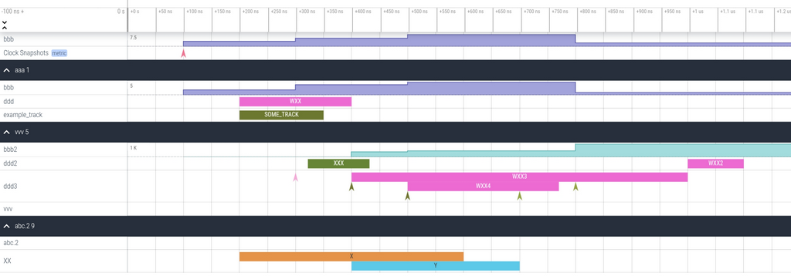

# tg4perfetto
Simple python library for generating your own perfetto traces for your application.

## Python application tracing
Example code (see tg4perfetto/example_profile.py for the code)

    import tg4perfetto
    import threading
    
    # A "stat" counter.  This can be used to log integers or floating-point stats.
    count_stats = tg4perfetto.count("num_active_threads")
    
    # Normally, tracks are assigned to its thread's default track.  This creates a custom track
    custom_track = tg4perfetto.track("TOP_TRACK")
    
    # Log the event on a thread-default track.  trace_func_args logs the arguments put on the
    # function, so be careful
    @tg4perfetto.trace_func_args
    def merge(x, x1, x2):
        # ... (omitted)
    
    def merge_sort_wrapper(x, flow_id):
        # Instant events
        tg4perfetto.instant("START_THREAD", incoming_flow_ids = [flow_id[0]])
        custom_track.instant("START_THREAD", incoming_flow_ids = [flow_id[1]])
    
        return merge_sort(x)
    
    def merge_sort_threaded(x):
        # Instant event.  Has two "flow ID" which can be used for connecting two events.
        flow_ids = tg4perfetto.instant("INVOKE_THREAD", num_outgoing_flow_ids = 2)
    
        t = threading.Thread(target=merge_sort_wrapper, args=(x,flow_ids))
        t.start()
        return (x, t)
    
    
    # Log the event on a thread-default track.  Unlike trace_func_args, trace_func
    # only logs the call in/out events.
    @tg4perfetto.trace_func
    def merge_sort(x):
        l = len(x)
    
        if l < 4096: return sorted(x)
    
        if l < 40000:
            x1 = merge_sort(x[:int(l/2)])
            x2 = merge_sort(x[int(l/2):])
        else:
            # Using count_stats to increment and decrement
            count_stats.increment(1)
            x1, t1 = merge_sort_threaded(x[:int(l/2)])
            count_stats.increment(1)
            x2, t2 = merge_sort_threaded(x[int(l/2):])
            t1.join()
            count_stats.increment(-1)
            t2.join()
            count_stats.increment(-1)
        
        return merge(x, x1, x2)
    
    # Log the event on the given specific track.
    @tg4perfetto.trace_func(custom_track)
    def validate(xarray):
        # ... (omitted)
    
    if __name__ == "__main__":
        # Start logging.  Logging stops when this goes out of scope.
        with tg4perfetto.open("tg4p.perfetto-trace"):
    
            # Use a custom track.
            # to put into the default track. just use tg4perfetto.trace(...) instead.
            with custom_track.trace('SORT').get_outgoing_flow_ids(1) as out_flow_id:
                xarray = [ (17 * x + 8) % 100 for x in range(100000) ]
                xarray = merge_sort(xarray)
    
                # Create one flow ID from the current track.  We can create flow IDs before closing the track.
                p = out_flow_id[0]
    
            # Set the incoming flow ID (optional, set only if there are any).
            with custom_track.trace('VALIDATE').set_incoming_flow_ids([p]):
                tg4perfetto.instant("CHECKING", {"final_result": xarray})
                validate(xarray)
                print("Done")

This will generate a trace file named "tg4p.perfetto-trace" which can be read from perfetto.

## Custom packet generation
Example code (see tg4perfetto/example.py for the code)

    # Packets can be created out-of-order.  This is because perfetto is designed to process out-of-order traces
    # and reads all packets at once, rearranges them, and then visualizes it at once.
    tgen = TraceGenerator(sys.argv[1])
    pid = tgen.create_group("aaa", "example_track")
    pid.open(100, "SOME_TRACK")
    # "Flow" packet.  this will create an arrow from here to "open" event down there (400ns)
    pid.close(250, [4])

    # Global counter track
    tid = tgen.create_counter_track("bbb")
    tid.count(0, 3)
    tid.count(200, 5)
    tid.count(400, 7)
    tid.count(700, 2)

    # Counter track within the "aaa" group"
    tid = pid.create_counter_track("bbb")
    tid.count(0, 2)
    tid.count(200, 4)
    tid.count(400, 5)
    tid.count(700, 1)

    tid = pid.create_track("ddd")
    tid.open(100, "WXX")
    # another "flow" packet.
    tid.close(300, [3])

    tgen.flush()

    pid = tgen.create_group("vvv")
    tid = pid.create_counter_track("bbb2")
    tid.count(0, 2)
    tid.count(300, 400)
    tid.count(400, 500)
    tid.count(700, 1000)

    tid = pid.create_track("ddd2")
    tid2 = pid.create_track("ddd3")

    tid2.instant(200, "WXYZ")
    tid.open(222, "XXX")
    tid2.open(300, "WXX3", {"aaa":"bbb", "ccc":"ddd"})
    tid2.instant(300, "ABCDE", {"aaa": "bbb", "ccc": "xxx"})
    tid.close(333)
    # receives an arrow from the packet above.  this can be either from an instant event or a normal event.
    tid2.open(400, "WXX4", {"aaa":"bbb", "ccc":"ddd"}, [3, 4])
    tid2.instant(400, "ABCDE")

    # Some annotation on instant event
    tid2.instant(600, "ADE", {"aaa": "abc", "ccc": "xxx", "eee" : {"aaa": "abc", "ccc": "ddd"}})
    tid2.close(670, [2])

    # very complex annotations!
    tid2.instant(700, "ADE2", {
        "aaa": "abc",
        "ccc": [1, 2, 3, 4, "a", "b", {"abcdef" : "fdsa", "ggg": True}],
        "eee" : {
            "aaa": "abc",
            "ccc": True,
            "eee": {
                "fff": "ggg",
                "hhh": 0x1234567
            }
        },
        "jjj": "kkk"
    }, [2])
    tid2.close(900, [1])
    tid.open(900, "WXX2", {"aaa":"bbb", "ccc":"ddd"}, [1])
    tid.close(1000)

    pid4 = tgen.create_group("abc.2")
    tid4 = pid4.create_group("XX")
    t1 = tid4.create_track()
    t2 = tid4.create_track()
    t1.open(100, "X")
    t2.open(300, "Y")
    t1.close(500)
    t2.close(600)

Example output:

